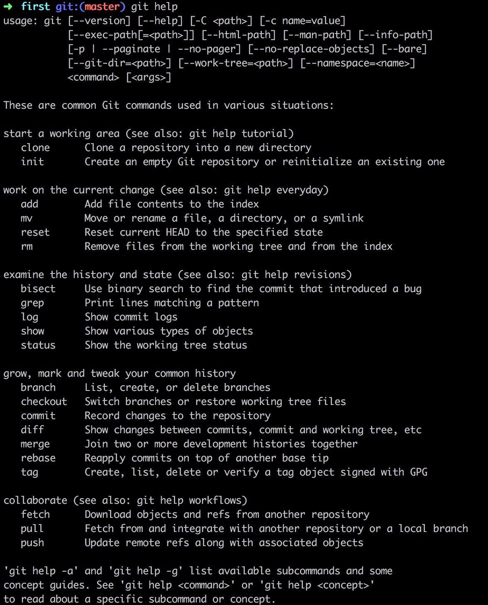

## 20160724 日记 晴 27~35'c 青岛

> 我也不知道我为什么来到这个世界，这个国家，这个城市，但是我想认真，努力的活着。
>     --陈曙光

### 上午

上午差不多醒的时候是在8点左右吧。周末总是不想起床。到11点起床定了一个外卖然后冲个澡。忽然想到GTD，GTD是个什么玩意，我想我一定要搞明白。


GTD 解释：

```
简单来说就是把事情做完。
```

1. GTD核心：
	1. 把事情做完，让大脑清空
	2. 专注于做事情，而不是记事情
	
2. 执行顺序：
	1. 收集
	2. 整理
	3. 组织
	4. 回顾
	5. 执行


### 下午

下午看了会手机，看了一部非常简单的美国电影 
__第五波__

> 主要讲述的是一个外星球入侵的故事，女主在一路找弟弟中收获一枚男子成功识别外星人计划。典型的美国主义电影。


打了一波的海岛奇兵，整体还不错。至少这个游戏公司出的游戏都还算是精品游戏。supercell一个日本游戏制作公司。


玩着玩着就瞌睡睡了。下午5点多妈妈打电话聊了一会。大多都是家常。和妈妈的聊天方式有待改进，可以

1. 多聊聊妈妈身边的人
2. 多聊聊妈妈工厂里的事情
3. 聊聊我们认识的人和事情

反正多学习多改进吧。人生山高路长的。一定要和家人和睦相处。


### 六点之后


1. 整理了一下gitbook上写的书的问题
2. 接着把没学完的markdown 语法学习结束
3. 图片其实是个好东西，我需要加一个图片的文件夹

git command 命令集合



