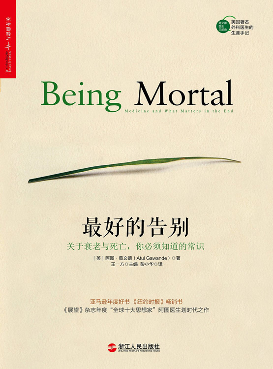

# 最好的告别  - 阿图·葛文德

> 关于衰老和死亡，我们需要知道的一点小事情。
> 衰老和死亡都是我们需要知道的一件事实，在知道这件事实之后，我们还需要了解自己希望得到什么？可以放弃什么？对于现在还有什么想做的？以及什么是自己时下最不想做的？
> 在阿图·葛文德医生笔下通过自己了解身边人，了解当前的医疗环境给出了一份自己的见解。正确与否不争论，难能可贵的是一个解读死亡和衰老的角度。

1. 个人独自生活的持续
	
	从出生，不能独自进行生活，到6，7开始独立生活，我们将会一直生活到老。八大日常生活活动（如厕，进食，穿衣，洗浴，整容，下床，离开座椅，行走），八大日常生活独立活动（自行购物，做饭，清理房间，洗衣服，服药，打电话，独自旅行，处理财务）。上述的日常生活都是从童年的年龄段开始建立起来的一种能力。但是到了老年之后，开始丧失这些能力，个人独自生活的持续就会出现一系列问题。经历过那么多生活，到了与死亡和衰老抗争的时候？我们开始对独自生活有了恐惧，有人对生活的剥夺感？无论是养老社会的问题还是个人家庭的问题，可是我们是不能独自生活了，这就是一个事实。
	
2. 对个人独自生活的崩溃
	
	当我们开始意识到自己不能独自生活时，大多数时候是会崩溃的，因为你发现不能尿尿了，你发现不能喝酒吃烧烤了，所有你之前一个人建立的生活轨迹和生活乐趣全部在这一个时间段被衰老和死亡剥夺。在这个时候需要的是对现实的事实的清晰认识，让自己开始接受这些事情，并认识到自己的身体的变化和自己情感需要。这个时候你需要爱人陪在身边或者你需要子女，朋友和你聊聊天。所以这个时候不是气馁，不是放弃，而是清晰，冷静的思考，我们现在需要什么？不需要什么？想做什么？不想做什么？
	
	
3. 开始依赖外界
	
	在知道自己那些事情需要帮助的时候，可以依赖外界的时候。开始依赖子女，开始依赖社会。子女和社会要随时准备好这个事情。但是在依赖社会和子女或者依赖他人的时候，会产生一种，我被外界束缚的感觉，因为你不能做什么，什么时候需要做什么，都是在你依赖的身上发生的事件。在开始依赖社会和子女的时候，尽可能的进行沟通和商量，让自己心情和外界的对自己的帮助是一种契合。而不是争端的开始。比如在文中，有与疗养院的不配合（当然疗养院也有一些不是人文关怀的因素在里面，他们只考虑了安全和尽可能延长寿命。），与子女的家庭矛盾。开始依赖外界之前是否可以多加搜集一些内容，并对这个做出自己的评断。
	

4. 需要外界帮助才能进行生活&更好的生活
	
	到了需要外界帮助才能生活的阶段的时候，大多数是不能做什么抗争的事情，但是在某一些集体性的团体中却也可以暴露出最大的隐患。比如：飞越疯人院式的集体事件。这个时候我们需要对外界来要求一些，或者思考一些事情，为什么在死亡和衰老面前那些疗养院什么都不做？书中一个年轻人的案例说：他在一个疗养院放出了猫，狗，鸟还有花草。这些都需要那些需要面对死亡和衰老的人们自己的事情，你要自己养花，但是你需要帮助的时候，护工也会在这个时候帮助你。你会不会觉得他们是看管烦人的警察呢？我想这个时候你更多会觉得他们是家人。这个时候你能控制你所有的生活，比如你看篮球比赛的时候可以大喊大叫可以喝上一杯。外界的思考和帮助在这个时候显得尤为重要。
	

5. 放弃与死亡和衰老的战斗

	在死亡即将到来之前会不会有医生来对你说各种治疗方案，让你自己选择资料方案，还是医生使用自己的权威，来决定你要采用那种治疗方案让自己活得更长（其实有没有更长没有人知道）。有没有与你谈到你是否要停止治疗或者采用观察性的治疗，并采用善终服务。在生命的最后时刻是否要做些什么？
	
	* 如果你的心脏停搏，你希望做心肺复苏吗？
	* 你愿意采用如插管和机械通气这样的积极治疗吗？
	* 你愿意使用抗生素吗？
	* 如果不能自行进食，你愿意采用鼻饲或者静脉营养吗？

	通过回答上述一些问题，来决定你是否愿意接受死亡。
	明白所有的生命都是消逝，并且做出之前自己愿意做的和强烈不愿意做的事情。我觉得这就是莫大的勇气。在放弃时，依然可以选择和家人朋友在一起。并接受这最后的时光。
	
6. 温柔且正确的对待死亡和衰老

	当需要外界做出判断的时候，什么时候停止使用起搏器？什么时候采用善终服务？这些都是在咨询性医生的帮助或者家人的帮助下才能让死亡和衰老更易于让人接受。当医生了解了你不愿意身体插满管子，不愿意忍受疼痛的时候，需要去参加妹妹的婚礼，等等。当医生了解这些，了解你愿意做什么？不愿意做什么？知道自己生命终点即将来临。这个时候医生会像军师一样给出你建议。你也了解自己内心是如何想的。以及医生和家人如何去做。

7. 活着的人且以最大的勇气来面对死亡

	死亡来临时，我们只能安静的看着，或者远远观察着。不然他们在受一点点疼痛。在死亡之后，我们还会怀念着他们。并且以更大的勇气和慰藉继续生活。我们怀念他们，我们更好的继续生活。这才是生活该有的样子。
	
	
	ps：文中各种以我和各种代词，其实是为了书写流畅。如有不便，多多包涵。

