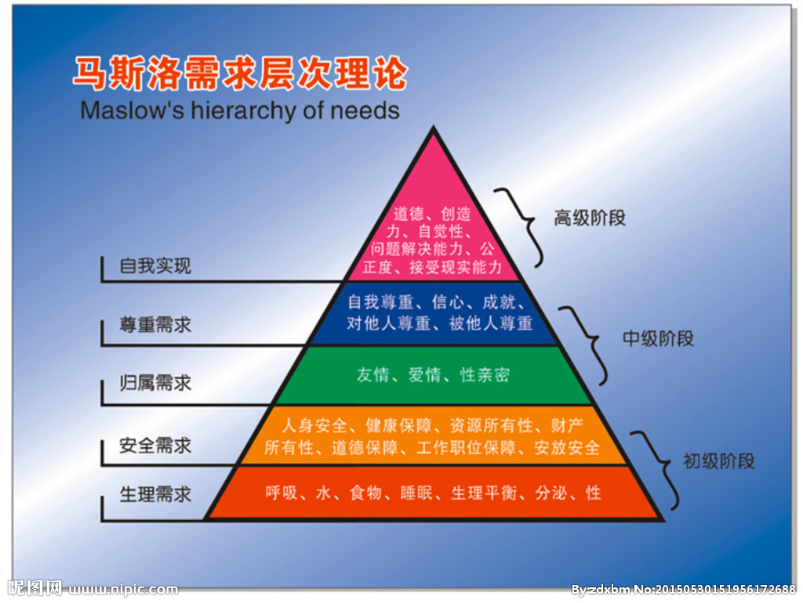

# 黑客与画家

> 分析，总结，修改，快速。

保罗·格雷厄姆-Lisp推广者，Lisp专家。2005年创建YC（传奇天使投资公司）。当然这些只是一些简介。我是从大狗熊的狗熊有话说了解到保罗，听到大狗熊讲到在阮一峰老师的博客上了解到保罗。对于两位老师，我经常看阮老师的博客，听大狗熊的播客。所以算是有一个浅显的了解。保罗的了解也是听以上老师的讲解，然后自己查资料。保罗确实是一位很牛的黑客程序员。

__黑客与画家__ 是一个科技随笔。我现在读了前五段小故事。先讲一讲这些吧。

1. 为什么书呆子不受欢迎
	
	
	书呆子是否本质上和受欢迎的学生有区别，区别是什么？
	
	
	书呆子本质上追求的是聪明，追求的能力与智力的比拼。只想让自己更聪明，也有想让自己受欢迎的心态，但是相比之需要变聪明，这个受欢迎就不重要起来了。
	实质上聪明在成年之后会带来更好的生活，更好的物质。反而比受欢迎重要。
	群体性的可见性，根据不同的人群可以划分不同的群体。比如困在学校的学生，困在监狱的囚犯，困在格子间的上班族。内部是否一篇祥和，斗争是否存在？是否为了打压别人就是纯粹的打压别人。初高中的群体性斗殴事件。监狱囚犯群体性的打杀事件。在无压力的环境中，需要自己的心理成长和外在的成长是否在同步进行。在工业社会，我们需要对即将成人的学徒进行传帮带的形式进行辅导，以便于更好的工作。而现在只要大学毕业就可以找工作，上班了。在少了成年工作者对未成年的一种帮助和教育。未成年人也缺乏对成年工作者的尊重和重视。
	
	
2. 黑客与画家

	工作本质是否有区别？黑客怎样定义自己？画家如何定义？
	
	工作性质都是进行创作。黑客写出优秀的软件。画家画出美丽的画作。
	
	
	__黑客有自己独特的品质。__
	
	* 对自己软件世界的执着
	* 先做出来
	* 相互认同，换位思考
	

3. 不能说的话
	
	* 是否随大流
		
		在群体中是否有自己的看法，时候有和大家不一样的想法。这决定了你是否有自己的想法和自己的理解。
		
	* 真话

		判断言论的真伪。
	
	* 异端邪说

		有争议的话？政治不正确？我们有没有认真思考过？
		
	* 时空差异

		对比不同时间段发生的事情？diff一下这个世界会发现很多不能说的话。这是为什么？
	
	* 道貌岸然
		
		伪装，学会伪装也是这个世界最真实的样子。
	
	* 机制
		
		不能说的话，流行产生的机制。社会斗争的原因。
	
	* 为什么这样做

		突破，打破常规和大多数。
		
	* 守口如瓶

		自由的思考，不要说。和一些同道人讨论，随便说。
	
	* 笑脸相迎

		笑脸和政治正确的话。不至于让自己陷入麻烦。
	
	* 永远质疑

		广度上做到全知。深度上做到了解。清晰的知道必须远离人群才会有助于自己思考。
	
	
4. 良好的坏习惯

	hacker的思想，精通，随意支配计算机。满足智力上的好奇心。不服从管教。最简单的就是如何让自己自由以及如何共享，不想要禁止的东西。保持高度的敏感性。（有时候这些习惯对于正常的生活来说并不是好事）
	
	公民拥有言论自由和行动自由的社会，往往最有可能采纳最优方案。

5. 另一条路

	startup创业是一种新的方式。可以迅速改变个人财务。（更穷或者更富有）
	
	技术发展以及未来方向和趋势判断。
	
	
	* 选择编程语言进行软件开发
	* 软件进行快速发布
	* 收集用户意见
	* 快速改进用户意见
	* bug的问题
	* 小团队的快速优势将体现
	* 对项目进行投资和融资谈判
	* 尝试，尝试不可能

	
	这条路对未来来说是一个不确定的路，但是也是更快的进行社会财富和自由的快速分配。在产业中谈到软件部分和创业生存部分。

6. 如何创造财富 

	创业的科技成分很高才可以成功（取决于现在的科技成果）。
	创业中的运气成分很多，而且在接近成功的时候也并不是就是财富和金钱的对等。财富是多方面的。而金钱最多只能带来财务自由。只要你是马洛斯需求理论的中层次以上你在这个时候都不会在乎自己是否能获取更多的金钱。
	
	
	
	
	
	财富中的大饼，并不是一直不变的。其实是一个增长的曲线。比如你自己自行车坏了，又给修好了可以用了。这就是再次创造财富。上一次财富的衍生值。在修自行车的时候其实是一个手工艺人，在进行着一种创造。工作是什么？精细的社会分工中是一个螺丝钉，需要你钉在那，钉上就可以了。可是大多数现代的教育缺失了一种传递的手工艺人精神，工作中实习的实习生并不尊重正式员工（能力上），而正式员工因为与实习生的陌生感也产生了不欢迎实习生的事情。（总是把事情搞砸的实习生确实不怎么讨喜）。工作努力程度与可测试可观测性。有些工作无法测试，比如一个市长的工作，集团CEO，还有就是程序员等。但是可观察，比如一个城市的发展需要市长来进行决策，一个集团的市场向好和盈利状况是一个CEO的管理。所以可测量和可放大性是一些决策性的。如果自己能做到决策性的高位一定要自己进行决策。财务自由方面也需要这样的一些位置（可测量和可放大性）。创业表现的可测量性是小团队的工作，可放大的是高科技。了解潜规则也是创业路上需要知道的。在对用户上要快速获取用户，做出一些成绩来鼓励团队，鼓励自己。在创业中需要有创始人的绝对权力，这个可以让创始人更快更好的做出决策。财富在一定程度上会扰乱创始人的内心。
	
	
	
7. 关注贫富分化

	财富观点

	* 从小被误导的财富看法
	* 历史上财富积累的方式大多名声不好
	* 担心收入差距拉大对社会产生不利影响

	思考 __不公平__ ? 
	不公平的是什么，是千万倍与你的收入还是你能力不及。在考虑这个问题的时候就要思考来源问题。比如我喜欢的NBA球员詹姆斯，能力在nba巅峰层级的球员。在个人影响范围上，詹姆斯的个人影响决定着他代言的产品的销量和收入。带来的是真真切切的钱。在篮球比赛中个人能力显著，风格异样。所以也代表着自己队伍的关注度和财务收入。所以詹姆斯在大部分上都是比很多人强大。所以不公平基本上是很少的。
	
	财富随着社会进步，获取方式也在改变，生产方式也在改变。
	比如香港之前靠着黑帮，毒品，等等成功开启了经济起步。但是当古惑仔发现走私苹果手机更赚钱的时候就不会去打打杀杀，这算不算社会财富支配社会进步，或者社会进步促进了社会财富的分配。保持财富个人私产的合法也是促进个人和社会进步。偷窃和技术杠杆的效应其实就是社会科技进步带来的财富分配和财富的个人合法。
	现代社会的收入差距大是一种社会健康的表现。技术使得生产效率的差异加速扩大。这种扩大没有反应在收入上则是因为
	
	* 技术革新停止
	* 创造大部分财富的人停止了工作
	* 创造财富的人没有获得报酬

	上述都不会对社会发展有利。
	
	

8. 防止垃圾邮件的一种方法

	防止垃圾污染自己的时间线。只看重要的内容，需要过滤一些重复，不重要，不关心的内容。所以需要净化自己的食物。互联网食物——其实都是垃圾食品。过滤是一步选取自己喜欢食物的技术和能力。希望每个人都有。

9. 设计者的品味

	设计师需要有自己的品味，每一个人都需要有自己的品味。品味其实也有优秀高低之分。大多都喜欢美，喜欢自然。所以设计师读这部分可能更有感受。

10. 编程语言的解析 & 一百年后的编程语言 & 梦寐以求的编程语言 & 设计与研究

	编程语言的设计，编程语言的成长，编程语言的解决问题能力。机器运行时的机器码，编程语言的动态解析变异，静态语言的解析为了二进制码在解析为了机器码。等等这些是在了解语言编程之后才能了解的。我现在只了解这些单词的拼写。以后有时间再重读，在重新补写这部分的感受。

11. 拒绝平庸

	书中说的是拒绝平庸。可是我想说的接受平庸。并且改变一些事情，继续学习一些事情。

12. 书呆子的复仇

	书呆子的智商和知识碾压，让科技和社会进步。产生很多 __高__ 科技的东西。我说的高其实是高智商。高能力。

在本书中有很多思考。主要是信息科技和互联网科技对社会的正面促进。对于未来有很多想法和看法。比如CPU，计算机运算能力的告诉提升。对未来编程语言的思考。

