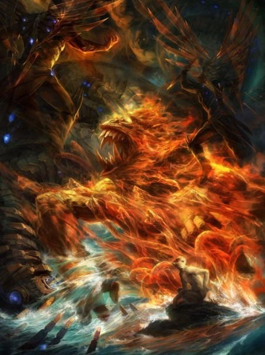

# 悟空传 

> 大圣，齐天大圣。我们小时候不都是那个不懂事的小松鼠吗？
> 斗战胜佛，我们后来不都妥协了吗？说着好听的话，为师傅？为紫霞？

两次两个多小时读完了今何在的悟空传，想着写写。那现在就写写吧。完全无章法。

悟空谁给的名号？道法皆空？谁给的快乐？所以后来剩下的那个猴子还是自己吗？确是确也不是？
懵懂出生，开心的生活。路上遇松鼠，你说树叶会说话，对啊。我就是那一片叶子。得道改变命运？改写的是谁的天书？还不是被 __大士__ 写好，你只管自己，那看懂看不懂？打的天宫震怒，确也是无可奈何？后来强贵 __正途__ ?路上得遇良人，得遇痴心？遇到的不就是之前的自己吗？越走越远？越走越发现自己走不了？却也不想世界那么大？怎会无力容身之处？

> 紫霞依然苦等。
> 月神和天蓬一起消逝。
> 松鼠还在看
> 江流儿那不是你吗？
> 小龙女

在看一下悟空的歌，你会不会发现你更懂得了悟空传。

> 月溅星河 长路漫漫
> 风烟残尽 独影阑珊
> 谁叫我身手不凡
> 谁让我爱恨两难
> 到后来 刚肠寸断
> 幻世当空 恩怨休怀
> 舍悟离迷 六尘不改
> 且怒且悲且狂哉
> 是人是鬼是妖怪
> 不过是心有魔债
> 叫一声佛祖 回头无岸
> 跪一人为师 生死无关
> 善恶浮世世真假界
> 尘缘散去不分明
> 难断
> 我要这铁棒有何用
> 我有这变化又如何
> 还是不安还是氏惆
> 金箍当头 欲说还休
> 我要这铁棒醉舞魔
> 我有这变化乱迷浊
> 踏碎凌霄 放肆桀骜
> 世恶道险 终究难逃
> 这一棒
> 叫你灰飞烟灭

读懂了西游记的人都明白，西游记是一个彻头彻尾的悲剧故事。佛门三千，多了一个可有可无的猴头，天地间却永失一腔敢于齐天的热血。叫一声佛祖，回头无岸：指悟空踏上佛门，已经没有回头的余地，他再也不能做以前那个热血自由自在的猴头。跪一人为师，生死无关：并不是讲得拜唐僧为师，而是说菩提祖师。

最后：希望过好自己。

1. 不要过高的正义。
2. 追寻自己想要的，（纵死无悔）
3. 制度保证还是需要的，（保证作为 __人__ 的权利）

读完这本和当时读完苏菲的世界的感觉是一样的。觉得身体空虚，却也想不出什么来。ps:写这篇文章的时候一直在听悟空

