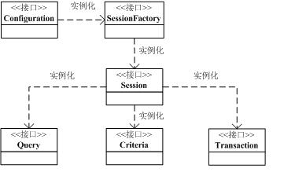

## hibernate聊聊第一讲

Javaweb开发中对数据库分层是一种代码解耦的方法。数据库在Java早起开发中多是重复，无聊的代码，数据库连接，开启事物，执行sql，提交sql，关闭事务 ，关闭连接。等等。一段时间出现了hibernate和很多orm框架。让Java开发者省去了很多时间。现在来看一下hibernate。

域模型-在软件分析阶段创建的，帮助开发人员获得清晰，精确的理解。
域模型基本构成-域对象。

1. 实体域对象
2. 过程域对象
3. 事件域对象

域对象之间的关系

1. 关联关系
2. 依赖关系
3. 聚集
4. 一般化

java对象的持久化

1. JDBC API持久化对象，重要的类
	*  __DriverManager__ ：驱动程序管理器，负责创建数据库连接
	*  __Connection__ ：代表数据库连接
	*  __Statement__ ：负责执行sql语句
	*  __PreparedStatement__ ：负责执行sql语句，具有预定义sql语句的功能
	*  __ResultSet__ ：代表sql查询语句的查询结果

	上述编程方式带来的影响：
	
	*  业务逻辑和数据库访问代码掺杂在一起
	*  关系逻辑中嵌入关系的sql语句
	*  业务逻辑和关系数据模型绑定
	*  代码中sql语句错误在编译时不能检查这种错误

2. ORM 简介

对象关系映射（ __ORM__ ，即 __Object-Relation Mapping__ ）模式指的是在单个组件中负责所有实体域对象的持久化，封装对象的数据访问细节。

ORM解决的主要问题就是对象-关系的映射。域模型和关系数据库模型分别建立在概念模型的基础上。域模型是面向对象的，而关系数据模型是面向关系的，一般情况下，一个持久化类和一个表对应，类的每个实例对应表中的一条记录。


| 面向对象概念 | 面向关系概念 |
| :-: | :-: |
| 类 | 表 |
| 对象 | 表的行（记录） |
| 属性 | 表的列（字段） |


正式开始hibernate了。
在此之前需要在项目中加入hibernate的核心依赖，推荐使用maven。进行项目搭建。


```
<?xml version="1.0" encoding="UTF-8"?>
<!DOCTYPE hibernate-configuration PUBLIC
        "-//Hibernate/Hibernate Configuration DTD 3.0//EN"
        "http://www.hibernate.org/dtd/hibernate-configuration-3.0.dtd">
<hibernate-configuration>
    <session-factory>
        <!-- Database connection settings -->
        <property name="connection.driver_class">com.mysql.jdbc.Driver</property>
        <property name="connection.url">jdbc:mysql://localhost:3306/blog</property>
        <property name="connection.username">root</property>
        <property name="connection.password">root</property>
        <property name="javax.persistence.validation.mode">none</property>
        <property name="dialect">org.hibernate.dialect.MySQL5InnoDBDialect</property>
        <property name="current_session_context_class">thread</property>
        <property name="show_sql">true</property>
        <property name="format_sql">true</property>
        <property name="hbm2ddl.auto">update</property>
        <mapping class="com.chen.login.model.LoginUser"/>
    </session-factory>
</hibernate-configuration>
```
上述配置之后可以使用hibernate进行数据库操作。现在来看看hibernate API 。看看hibernate的核心接口。

1. 提供访问数据库的操作（保存，更新，删除和查询对象）的接口，接口主要：Session，Transaction，Query
2. 用于配置hibernate的接口：Configuration
3. 使用应用程序拦截hibernate内部发生的事件，并做出相关回应。接口主要：Interceptor，LoadEventListener，SaveEventListener
4. 用于扩展hibernate的功能的接口，接口主要：UserType，CompositeUserType，IdentifierGenerator

核心接口：

*  __Configuration__ 接口：配置hibernate，根启动hibernate，创建 __SessionFactory__ 对象
*  __SessionFactory__ 接口：初始化hibernate，充当数据存储源的代理，创建 __Session__ 对象
*  __Session__ 接口：负责保存，更新，删除，加载和查询对象
*  __Transaction__ 接口：管理事务
*  __Query__ 和 __Criteria__ 接口：执行数据库查询

核心类图


