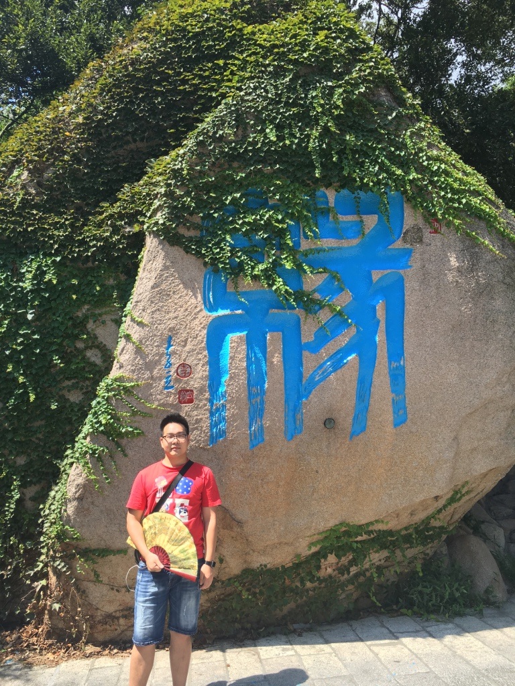
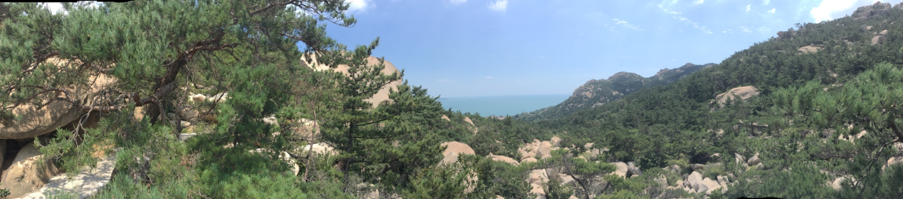
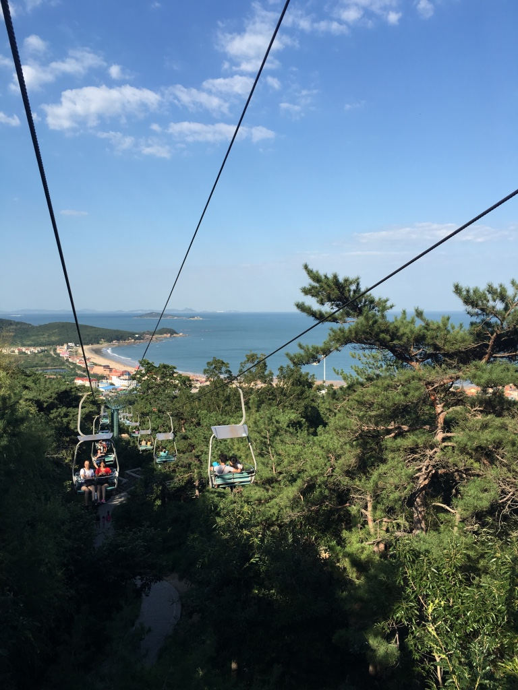
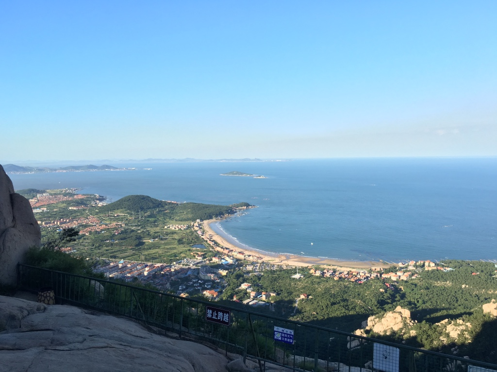
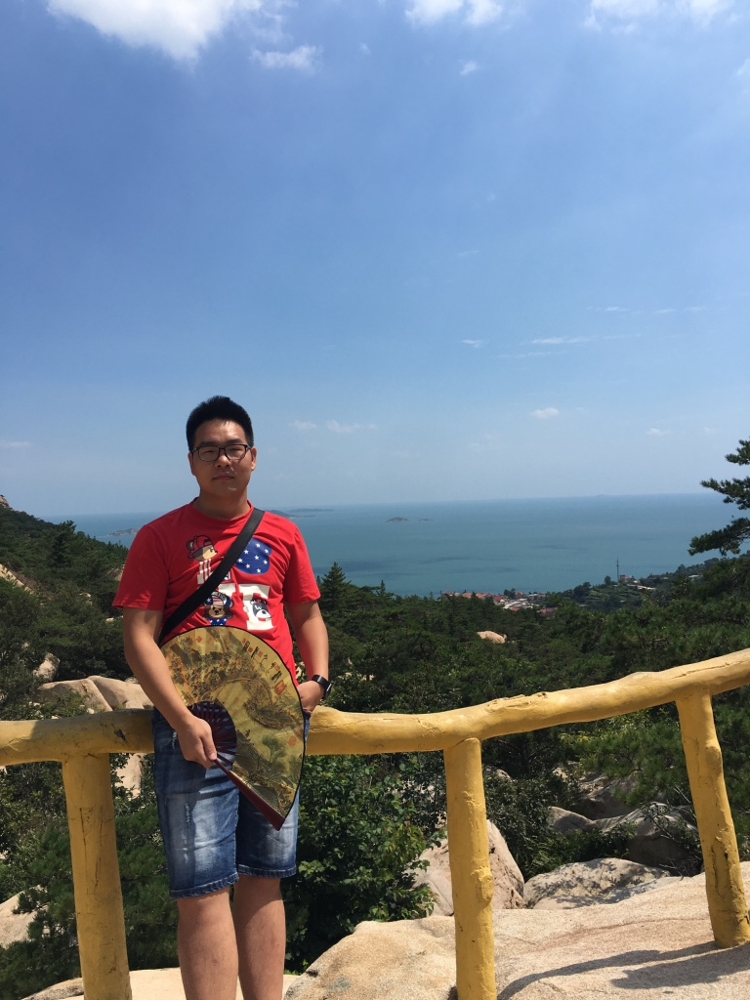

## 缘 - 与崂山的缘，与青岛的缘

 

来到青岛也是没想到的事情，所以上了题图的缘这个字，缘看着没什么。其实也就没什么。那我说说我对于缘，对于海，对于青岛这几个月来的了解与理解吧。

我想着以后有可能的话，我也会生活在青岛，物价一般消费每月估计2000就够了。加上租房水电的话单人不会超过4000.因为很多原因，至少不是北上广深杭那物价高的不要不要的。但是这里的服务没那么好，我说好是周到的意思。觉得青岛姑娘或者青岛人很好交流，你要说什么，你直接说就可以了。反正没那么多弯弯肠子。

再说说海吧。觉得海边最好的就是每周去海边或者海里边游一次，这样才能说自己在海边生活。不然海都没有了，我们玩什么呢？对吧。
而且我个人是很喜欢海的，因为和同事有点性格不合，所以在这方面他们也没想过要和我一起每周去海边玩一次或者游个泳什么的。这点我对自己还是觉得可惜的。反正现在道路那么长。慢慢来。

再来说说山，整个青岛都是在崂山山脉上起来的，所以崂山也是青岛对外的一张特别美得风景名胜片。当你给别人展示的时候当然是展示最美的，最美的就是崂山，崂山风景区中分为北九水，仰口，巨擘风景区三个，每个都要买票（这点本人不是很清楚）。但是真的好美，简单看看我的图你就知道了。

华严寺：

仰口：

天苑俯视图：

我：

海是蓝色的海，云是棉花般的云，山也是爬了2小时的山。想着在这生活也挺好。

生活就是，有吃的，生活舒适，有人。想想就是一幅很美的画。我就是画画的这个人。

