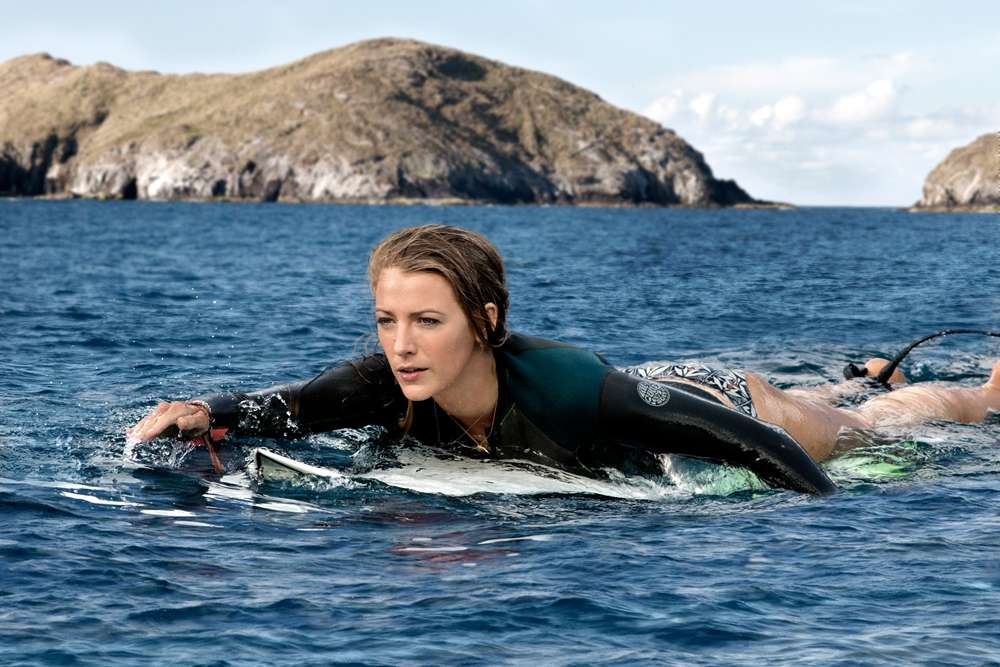

### 鲨滩（不剧透聊聊） 

> 女主很性感，女主很性感，女主很性感。
> 
> 重要的话说三遍。

__档期不算是好，也不算是坏。__ 暑期已过，上班族反正没什么假期。所以去看了这部鲨滩。在生活中，我们会追忆一些内在的和外在的。所以才会说“世界那么大，我想去看看”。试问：不缺钱不缺时间谁不想去呢？

在女主想去的时候恰好去了，有朋友但是和没有也没什么区别。追寻自己的心中的孕妇沙滩，美丽的海岸线。当然是帅哥和美女。冲浪。各种简单的炫技。

在所有人都走后，女主等最后一波浪，可没想到等来的确实鲨鱼。与人类打斗过的大鲨鱼，对人类也是极其残忍。撕裂，吞食。在看了几个人相继遇难之后，女主显然激怒了大鲨鱼，在与大鲨鱼的最后一搏中，讲大鲨鱼杀死。

最后被小孩子发现，被海水冲上海岸。还有一段是父亲争吵的插曲，其实到最后已经不是插曲。完美结局喽。

在生命遇到危险的时候，大多数会丧失理智和缺乏极限挑战式的能力冲刺。在经历了一天一夜后成功的靠着女主光环和理智杀死了鲨鱼。学会运用敌人的愤怒，学会运用环境。保持理智，冲刺和体力。这些大部分能决定是否可以生存下来。现在互联网不也是如此吗？

这是一篇补写公号文章。

